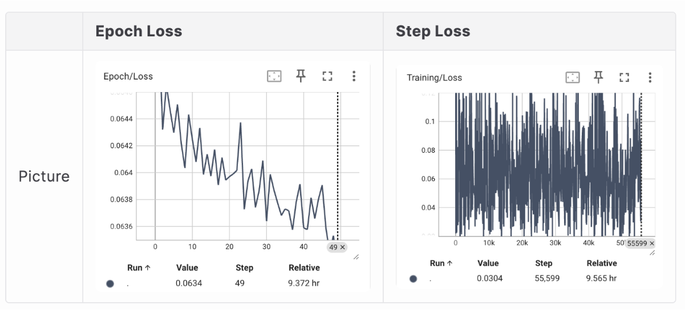
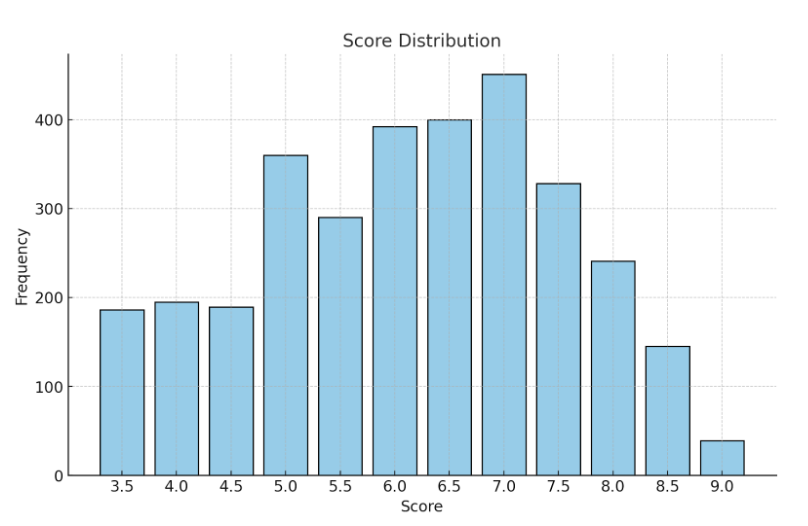
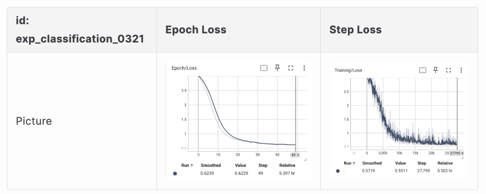

# AES: Automatic Essay Scoring using DeBERTa

This project focuses on **Automatic Essay Scoring (AES)**, particularly tailored for **IELTS writing tasks**. We fine-tune a DeBERTa model to assess writing quality either as a **classification** or **regression** task.

## 🧠 Core Idea

Using pretrained language models like `microsoft/deberta-v3-base`, we fine-tune on IELTS writing data to predict human-like writing scores.

## 📊 Experiment: Regression vs Classification in AES

During the fine-tuning of the DeBERTa language model for AES (Automatic Essay Scoring), we experimented with two different objective functions: **regression** and **classification**.

### 📉 Regression Training Results

As shown in the figure below, when training the model with a **regression objective**, the loss failed to converge properly and continued to fluctuate over time.

*Figure 3. Regression task training loss trends.*

Further evaluation showed that the model's predicted average score was 6.0. Upon analysis, we found this was due to **imbalanced data distribution**, which made it difficult for the model to learn meaningful score representations through regression. The essay score distribution is shown below:

*Figure 4. Histogram of score distribution (Total essays: 3,676).*

### ✅ Classification Training Results

To address the convergence issue, we re-formulated the problem as a **classification task**. Scores were mapped into 19 discrete classes, and the model was trained using **Cross-Entropy loss**.

This approach allowed the model to learn more robustly from the data and converge successfully, as illustrated in the following loss curves:

*Figure 5. Classification task training loss trends.*

Final evaluation results show that the model's predicted scores closely match human-labeled scores, with a **Mean Absolute Error (MAE) of 0.7064**, which is approximately within ±0.5 band of the true IELTS scoring range.

---

**Conclusion:**  
Formulating AES as a **classification** task provides significantly better training stability and scoring accuracy compared to regression, especially when working with imbalanced writing score distributions.
